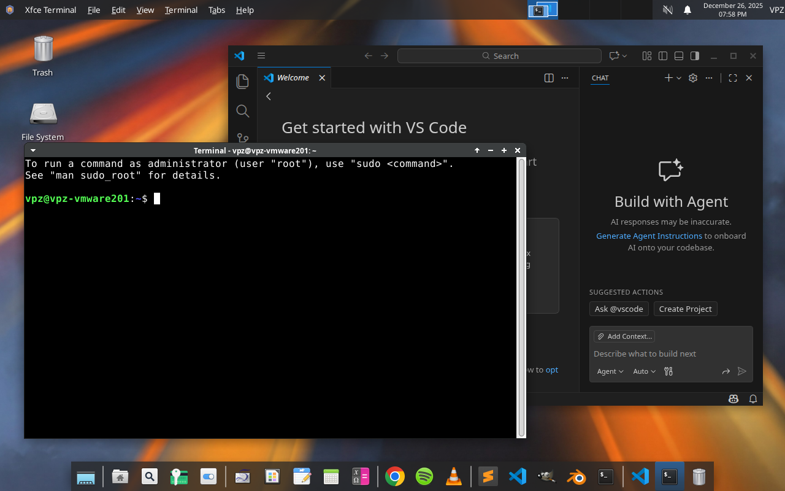

<div align="center">


# 🔥 Tejas Linux

**A lightweight, secure Ubuntu-based distribution with a transparent build system**

[](https://github.com/vaibhavpandeyvpz/tejas/actions)
[](LICENSE)
[](https://github.com/vaibhavpandeyvpz/tejas/releases)

[Download](#-download) • [Build](#-build) • [Test](#-test) • [Documentation](#-documentation)

</div>



## ✨ What is Tejas Linux?

Tejas Linux is a modern, lightweight Ubuntu-based distribution that prioritizes **transparency, security, and simplicity**. Built with a custom, fully auditable build pipeline (no `live-build`), it delivers a clean XFCE desktop experience with Secure Boot support out of the box.

### 🎯 Key Differentiators

- 🔐 **Secure Boot by default** - Works without custom keys or enrollment
- 🏗️ **Transparent build system** - Custom pipeline using debootstrap, casper, GRUB, xorriso
- 📦 **Offline installation** - Embedded APT repository for Secure Boot packages
- 🚀 **Single ISO** - Supports UEFI, Secure Boot, and Legacy BIOS from one image
- 🎨 **Two editions** - User (minimal) and Pro (developer tools)

---

## 📥 Download

### Latest Release

Download the latest ISO from the [Releases](https://github.com/vaibhavpandeyvpz/tejas/releases) page.

**Editions:**

- 🧑 **User** - Minimal system for general users
- 👨‍💻 **Pro** - Includes compilers, headers, and development tools

### Verify Your Download

All releases are GPG-signed and include SHA256 checksums.

```bash
# Import the signing key
gpg --keyserver keyserver.ubuntu.com --recv-keys A3F982C55AD5DA0B

# Verify the ISO
gpg --verify tejas-linux.iso.sig tejas-linux.iso
sha256sum -c tejas-linux.iso.sha256
```

---

## 🚀 Quick Start

1. **Write ISO to USB:**

   ```bash
   sudo dd if=tejas-linux.iso of=/dev/sdX bs=4M status=progress oflag=sync
   ```

2. **Boot** - Works on UEFI, Secure Boot, and Legacy BIOS systems

3. **Install** - Calamares installer launches automatically in the live session

---

## 🛠️ Build

### Using Docker (Recommended)

Works on Linux, macOS, and Windows:

```bash
# Build User edition
./docker-build.sh user

# Build Pro edition
./docker-build.sh pro
```

**Windows users:** Use `.\docker-build.ps1 user` or `.\docker-build.ps1 pro`

### Native Build (Ubuntu)

```bash
# Install dependencies
sudo apt install -y apt-utils debootstrap gnupg grub-common \
  grub-efi-amd64-signed grub-pc-bin mtools rsync shim-signed \
  squashfs-tools xorriso

# Build
PROFILE=user sudo iso/build.sh
```

Output: `iso/out/tejas-linux-<version>-<edition>-amd64.iso`

---

## 🧪 Test

### QEMU (Linux/macOS)

```bash
# Create disk
qemu-img create -f qcow2 tejas.qcow2 10G

# Run (Linux)
qemu-system-x86_64 \
  -machine q35 -m 2048 -smp 4 \
  -drive if=pflash,format=raw,readonly=on,file=/usr/share/OVMF/OVMF_CODE.fd \
  -drive if=pflash,format=raw,file=/usr/share/OVMF/OVMF_VARS.fd \
  -cdrom iso/out/tejas-linux-*.iso \
  -drive file=tejas.qcow2,if=virtio \
  -device virtio-vga -device qemu-xhci -device usb-tablet
```

**macOS (Homebrew):** Use `/opt/homebrew/share/qemu/edk2-x86_64-code.fd` and `edk2-x86_64-vars.fd`

---

## 📋 Features

### Boot Support

- ✅ UEFI
- ✅ Secure Boot (no custom keys)
- ✅ Legacy BIOS
- ✅ VMware, QEMU, Ventoy compatible

### Desktop

- 🖥️ XFCE desktop environment
- 🌐 NetworkManager for networking
- 📦 Snap support enabled

### Security

- 🔐 Secure Boot chain: Microsoft-signed shim → Canonical-signed GRUB → Canonical-signed kernel
- 🔑 GPG-signed releases
- 📝 Transparent, auditable build process

### Installation

- 🎯 Calamares graphical installer
- 💾 Offline Secure Boot package installation
- 🔄 Dual-boot support
- ⚡ Fast, streamlined installation flow

---

## 🏗️ Build System

Tejas Linux uses a **custom, transparent build pipeline** instead of `live-build`:

```
debootstrap → casper → GRUB (BIOS + UEFI) → xorriso
```

**Why custom?**

- Full control over boot layout
- Reliable Secure Boot support
- Predictable, debuggable builds
- No fragile legacy tooling

The build process is a **22-step deterministic pipeline** that's fully inspectable. See [`iso/build.sh`](iso/build.sh) for details.

---

## 📚 Documentation

- [**Build System Details**](README.md#build-system) - Complete build process documentation
- [**Repository Structure**](README.md#repository-structure) - Project organization
- [**Contributing**](README.md#contributing) - How to contribute
- [**Security Policy**](SECURITY.md) - Reporting vulnerabilities

---

## 🤝 Contributing

Contributions welcome! Areas we're looking for help:

- 🐛 Bug reports
- 📖 Documentation improvements
- 📦 Package suggestions
- 🔧 CI improvements
- 🎨 UX and branding enhancements

Please open an issue before making large changes.

---

## 📄 License

Tejas Linux is licensed under the **GNU General Public License v3.0 (GPL-3.0)**.

- All Tejas-specific scripts and configuration are GPL-3.0
- Ubuntu packages remain under their respective upstream licenses
- Tejas Linux is **not affiliated with or endorsed by Canonical**

---

## 🔗 Links

- 📦 [Releases](https://github.com/vaibhavpandeyvpz/tejas/releases)
- 🐛 [Issues](https://github.com/vaibhavpandeyvpz/tejas/issues)
- 🔒 [Security Policy](SECURITY.md)
- 📧 Security Contact: [tejas.linux@vaibhavpandey.com](mailto:tejas.linux@vaibhavpandey.com)

---

<div align="center">

**Built with transparency, designed for simplicity**

Made with ❤️ in India

</div>
